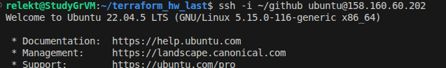

ИТОГОВЫЙ ПРОЕКТ TERRAFORM

Приложение FastAPI (как было в задании Виртуализация и контейнеризация)

Ссылка на исходный код:

https://github.com/Relekt71/terraform_hw_last.git

После выполнения команды terraform apply

Получаем registry ID и host ID (на локальном компьютере) в переменные окружения

    REGISTRY_ID=$(terraform output -raw registry_id)
    DB_HOST=$(terraform output -raw db_host)
    echo "Registry ID: $REGISTRY_ID"
    echo "DB_HOST: $DB_HOST"

Собираем образ и загружаем в Container Registry

    docker build -t cr.yandex/${REGISTRY_ID}/dev-rel:latest .
    docker push cr.yandex/${REGISTRY_ID}/dev-rel:latest

Подключаемся к VM с нашим ключем

Создаем директорию /opt/webapp

    sudo mkdir -p /opt/webapp

Создаем .env файл с параметрами подключения к Managed MySQL

    sudo tee /opt/webapp/.env << 'EOF'
    DB_HOST=<Суда Host ID>
    DB_PORT=3306
    DB_USER=app
    DB_PASSWORD=<Наш пароль ДБ>
    DB_NAME=<Имя ДБ>
    EOF

Добавляем nginx и haproxy (reverse proxy)

Создем конфиг haproxy

  
    sudo tee /opt/webapp/haproxy.cfg << 'EOF'
    global
     maxconn 1000

    defaults
      mode http
      timeout connect 5000ms
      timeout client 50000ms
      timeout server 50000ms

    frontend http_front
      bind *:8080
      default_backend http_back

    backend http_back
      balance roundrobin
      server web webapp:5000 check
    EOF

Создем основной конфиг nginx

    sudo tee /opt/webapp/nginx.conf << 'EOF'
    user  nginx;
    worker_processes  auto;

    error_log  /var/log/nginx/error.log notice;
    pid        /var/run/nginx.pid;

    events {
        worker_connections  1024;
    }

    http {
        default_type  application/octet-stream;
        log_format  main  '$remote_addr - $remote_user [$time_local] "$request" '
                          '$status $body_bytes_sent "$http_referer" '
                          '"$http_user_agent" "$http_x_forwarded_for"';

        log_format proxied '$http_x_real_ip - $remote_user [$time_local] '
                            '"$request" $status $bytes_sent '
                            '"$http_referer" "$http_user_agent" "$proxy_add_x_forwarded_for";';

        access_log  /var/log/nginx/access.log  main;
        sendfile        on;
        keepalive_timeout  65;
        include /etc/nginx/conf.d/*.conf;
    }
    EOF

Создем compose.yml с тремя сервисами

    sudo tee /opt/webapp/compose.yml << EOF
    services:
      webapp:
        image: cr.yandex/${REGISTRY_ID}/dev-rel:latest
        ports:
          - "5000:5000"
        env_file:
          - .env
        restart: always
        networks:
          - webnet

      haproxy:
        image: haproxy:2.4
        ports:
          - "8080:8080"
        volumes:
          - ./haproxy.cfg:/usr/local/etc/haproxy/haproxy.cfg:ro
        depends_on:
          - webapp
        networks:
          - webnet

      nginx:
        image: nginx:latest
        ports:
          - "8090:8090"
        volumes:
          - ./nginx.conf:/etc/nginx/nginx.conf:ro
          - ./default.conf:/etc/nginx/conf.d/default.conf:ro
        depends_on:
          - haproxy
        networks:
          - webnet

    networks:
      webnet:
        driver: bridge
    EOF

Скрипт деплоя

    sudo tee /opt/webapp/deploy.sh << 'EOF'
    #!/bin/bash
    cd /opt/webapp
    docker compose pull
    docker compose up -d
    EOF
    sudo chmod +x /opt/webapp/deploy.sh

Скриншот облака яндекс с адресом 

Скриншот консоли вм с приложением

Скриншот из браузера с приложением
